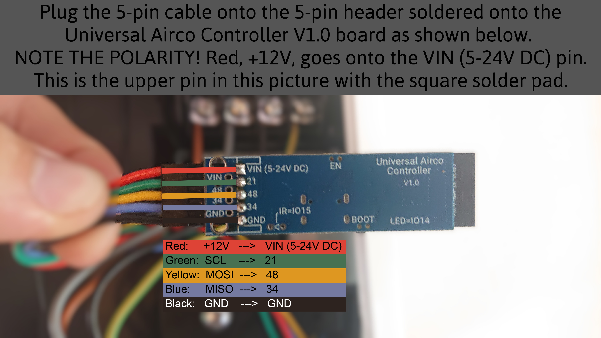

# Hardware

Hardware used:
- [Universal Airco Controller v1.0 (ESP32-S3 based)](https://www.tinytronics.nl/en/development-boards/microcontroller-boards/with-wi-fi/universal-air-conditioning-controller-esp32-s3)
- 5-pin female-female Dupont connectors cable
- 90 degree male pin header, row of 5

## Installation

All the parts you need.

Locating the connector on the main board.

Plug your connector into the CNS port.

Route the cable behind the plastic cover.

Further guide the cable.

After reassembling the indoor unit plastic casing.

Connect the universal airco controller to the cable.

Place your controller somewhere safe in the unit.

# Software
This hardware is only compatible with v4.2 and up, since the GPIO pins need to be set in the yaml file.

See sample.yml file for the example.
It is basically the simple.yml but with the pins set.